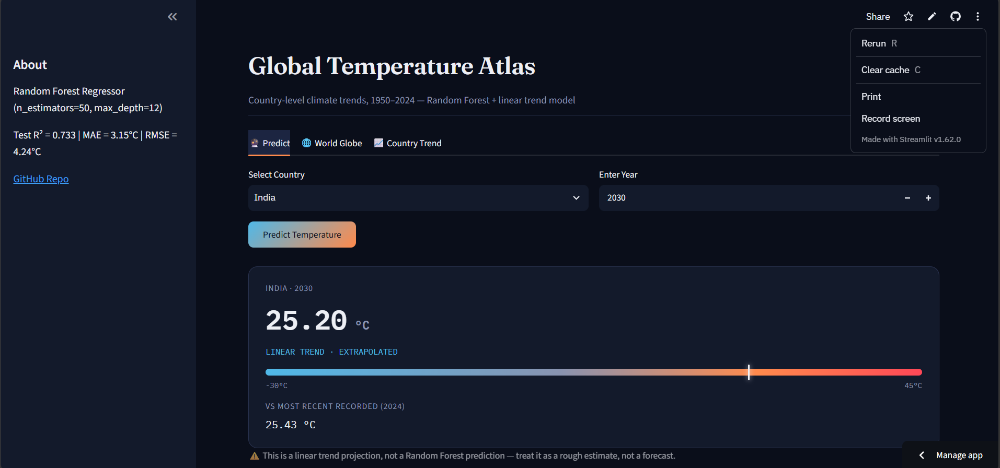
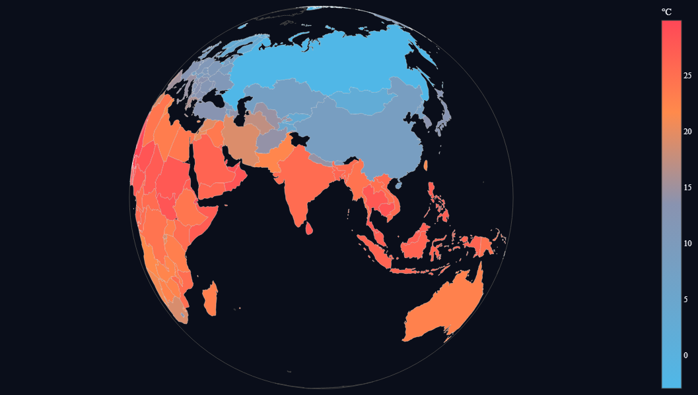
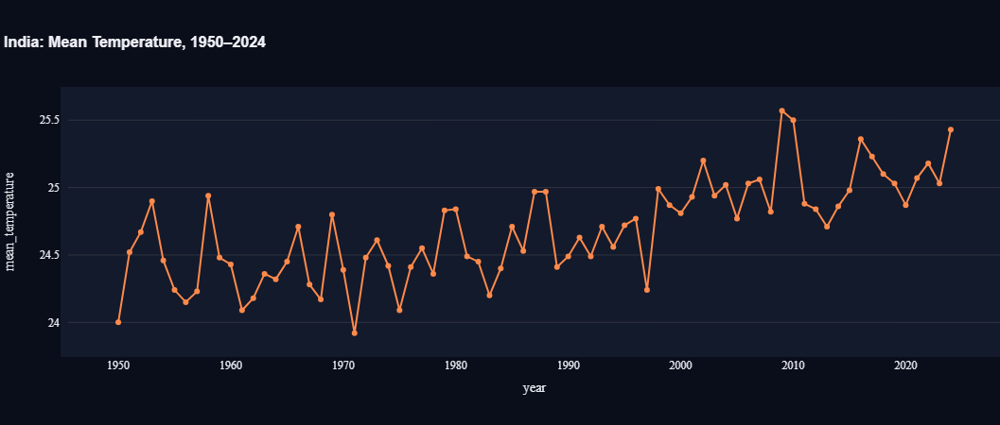

# Temperature Trend Prediction 🌡️

A machine learning project for predicting annual temperature trends using historical climate data,
built with Python, Pandas, Scikit-learn, and Streamlit — deployed as an interactive web app.


## Overview

This project builds a machine learning model to predict annual average temperature trends
from historical climate records, and serves predictions through an interactive Streamlit
web application.

## Dataset

- **Source:** `<ADD DATASET SOURCE — e.g. Kaggle link, ISTAT (Italian national statistics), or original data provider>`
- **Region/Coverage:** `<ADD — the filename suggests Italian annual average temperature data; confirm region/country>`
- **Time range:** 1950–2024
- **File:** `temperature-medie-annuali-1950-2024.csv`

## Approach

1. **Data preprocessing** — sorted by country/year, encoded country names with a label encoder
2. **Feature engineering** — year, decade, and cyclical (sin/cos) encodings of year to capture long-term trend and periodicity
3. **Model** — Random Forest Regressor (50 trees, max depth 12), trained on an 80/20 train-test split (`random_state=42`)
4. **Deployment** — Streamlit app (`app.py`) loads the trained model and label encoder to serve live predictions for any country/year combination

## Results

| Metric | Value |
|---|---|
| R² Score (test) | 0.7332 |
| R² Score (train) | 0.7319 |
| MAE | 3.15 °C |
| RMSE | 4.24 °C |

Train and test R² are nearly identical, indicating the model generalizes well and is not overfitting.
On average, predictions are off by roughly 3-4°C, which is expected given the model uses only
year/country/decade-level features rather than richer historical or climatological inputs.

## App Screenshot
## Screenshots

| Predict | World Globe | Country Trend |
|---|---|---|
|  |  |  |

## Project Structure

```
├── app.py                                    # Streamlit web app
├── temperature_model_v2.pkl                  # trained ML model (Random Forest)
├── label_encoder.pkl                         # encoder for categorical features
├── temperature-medie-annuali-1950-2024.csv   # dataset
├── images/                                   # app screenshot
├── requirements.txt
├── LICENSE
└── README.md
```

## How to Run

```bash
git clone https://github.com/Ansh-san/temperature-prediction-project.git
cd temperature-prediction-project
pip install -r requirements.txt
streamlit run app.py
```

The app will open automatically in your browser at `http://localhost:8501`.

## Limitations & Future Work
- The model predicts temperature from country and year only — it does not use actual historical
  temperature values, precipitation, CO₂ levels, or other causal climate factors, so it captures
  trend patterns per country rather than true climate dynamics.
- No cross-validation or hyperparameter search was performed beyond manual tuning of tree count and depth.
- Future work could add confidence intervals on predictions, incorporate additional climate covariates,
  or evaluate performance separately per country/region.
  
## Features

- Country + year temperature prediction (196 countries, 1950–2024)
- 🌐 Interactive rotating world globe (Plotly orthographic projection) colored by mean temperature
- 📈 Per-country historical trend chart
- Random Forest model (Test R² = 0.733, MAE = 3.15°C, RMSE = 4.24°C)
- ## Model Evaluation

Overall test-set performance: **R² = 0.733, MAE = 3.15°C, RMSE = 4.24°C**

Performance varies notably by country. Prediction error is lowest for smaller, climatically
uniform countries and highest for large, climatically diverse ones — a single national average
hides significant internal variation for a country like Canada or Kazakhstan, making its
year-to-year mean harder to predict than a smaller country like Namibia or Uruguay.

| Best predicted (MAE) | Worst predicted (MAE) |
|---|---|
| Namibia — 0.23°C | Canada — 18.13°C |
| Uruguay — 0.25°C | Estonia — 11.85°C |
| Mexico — 0.27°C | D.P.R. of Korea — 11.62°C |
| Zimbabwe — 0.34°C | Kyrgyz Republic — 10.71°C |
| Madagascar — 0.35°C | Czech Republic — 10.14°C |

## Live App
🔗 <https://temperature-prediction-project-njuttyubbfvtrq6pvk9jih.streamlit.app/>

## License

This project is licensed under the MIT License — see [LICENSE](LICENSE) for details.
